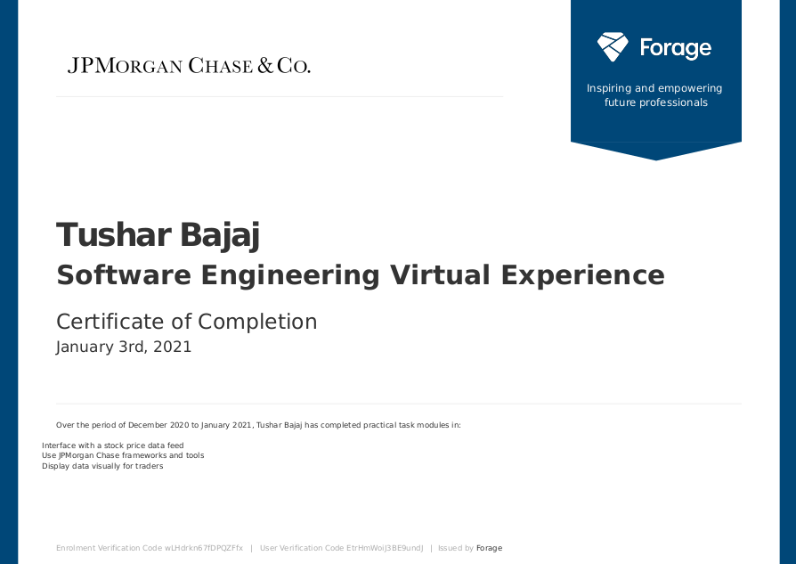

# JPMC Virtual Internship

## What is this?
This is github repo of project done by me during virtual internship with [**JPMC**](https://careers.jpmorgan.com/us/en/students/campaign/virtual-internship). In this project, I created a interface with a stock price datafeed to display data for traders using [**React**] with [**typescript**] as language.

## To know more about the tasks. Please click on the corresponding folder.

## My Certificate

